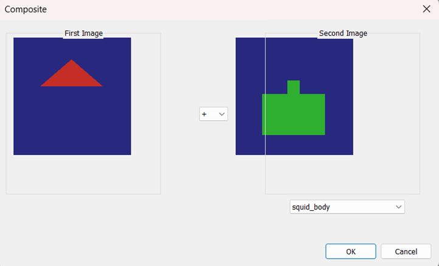
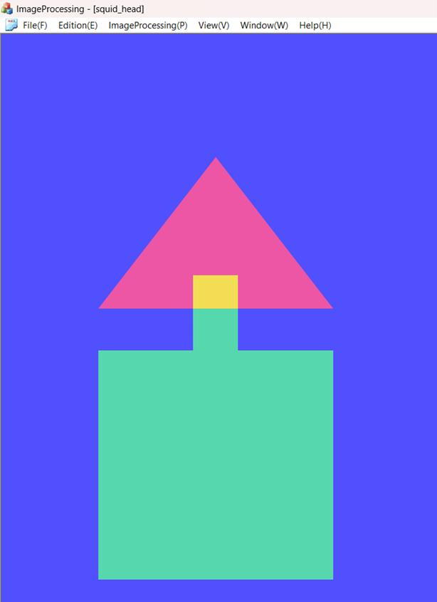
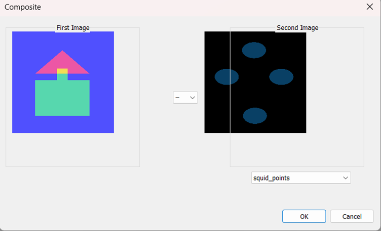
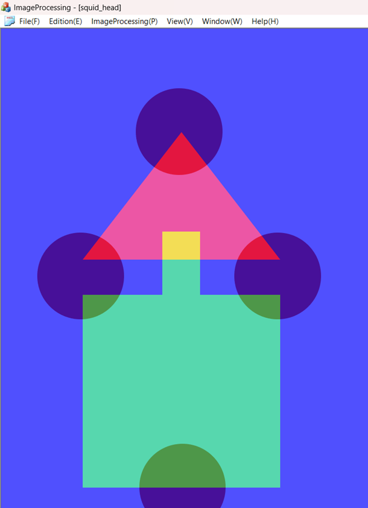
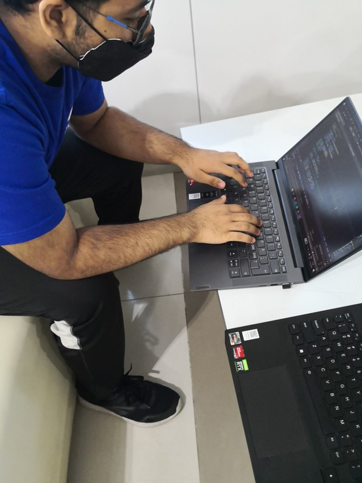

**Image Processing**  
**Team Project 1 \- Squid Game**

**Team Members:**  
**Mukund Kumra (Student ID \#50221574)**  
**Stefan Djordje Tomic (Student ID \#50221640)**

**Outline of program**  
The program presented in this report provides the user with the ability to combine multiple images by either adding or subtracting the RGB values of each pixel respectively.   
The program is written in C++ and the code that manipulates the provided images is implemented in the function OnProcessComposite. The main part of the function lies in the nested loop which iterates over each pixel in the images and handles their combination. 

**Design of program**  
Before reaching the main loop of the function, a couple of useful variables are defined. The variable *multiplier* is assigned the value of 1 or \-1 depending on whether the user wishes to perform addition or subtraction on the images respectively. Also the width and height of the images is retrieved. 

There's a nested loop which iterates over each pixel in the images. Inside these loops an array representing the RGB values of the combined pixel is defined. Thus the array is of size 3 where the first element is the Red value for the pixel from image 1, combined with the Red value for image 2\. The values are added together but one of them is multiplied with the variable *multiplier.* Thus we may achieve the effect of subtraction if the user wishes.

The array contains the type *int* because this type may contain negative values, which *DWORD* may not. Thus we can handle the cases of underflow by checking which values are negative after the subtraction and then setting them to 0 instead. The cases of overflow are handled in a similar manner where pixels whose values are greater than 255 are then set to 255\. 

Finally the pixel value of the new image is set to the corresponding RGB value of the array. 

**The spending time**  
The project was fairly simple and done in an efficient manner by the collaborative efforts of both the team members within the time frame of 1 hour.  
 

**Process of project and record of project meeting (Picture, Kakao Talk capture, or etc.)**

Process of The Project

1) Images provided for the project

2) Adding squid\_head and squid\_body

3) Resulting Image from adding squid\_head and squid\_body

4) Subtracting squid squid\_points from the resulting image  received from adding squid\_head and squid\_body

5) Final Result after adding squid\_head and squid\_body and subtracting squid\_points

**Record of project meeting**  

We finished the coding aspect of the project inside the lab and wrote the report after classes in a physical meeting. 

**Each team member's thoughts on this project**

Stefan:  
This project demonstrates how multiple images can interact to create a new one. This work has been interesting because we haven’t worked on multiple images before this project. Overall the project has been intriguing, but not particularly difficult. 

Mukund:  
This project successfully demonstrates the working of the composite function and how it may be used to combine the elements of two images into one by either adding or subtracting them one to/from the other.
